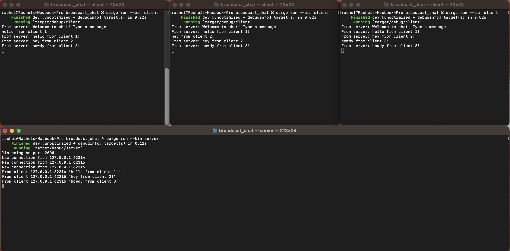
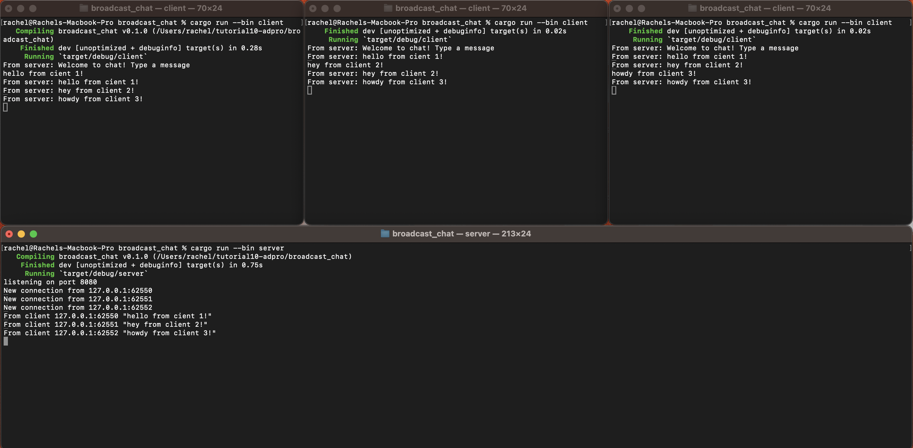

# Tutorial 10 - Broadcast Chat
**Rachel Heningtyas Zanetta Erari - 2206081944 - A**

## 2.1 Original Code & How It Runs

After running the server using the command `cargo run --bin server` and each client with the command `cargo run --bin client`, the output shows that each client and the server receive broadcasted chat messages from every other client. Whenever a client types a message into the command line, that string is sent to the server, which then forwards it to all connected clients. This mechanism ensures that every participant in the network can see the messages sent by each client, facilitating a real-time, multi-user chat environment.

## 2.2 Modifying the websocket port

To ensure the functionality, we need to modify the ports in both `client.rs` and `server.rs`. If either of these files has a different port from the other, the client will not be able to connect to the server. This alignment is crucial for establishing a successful connection between the client and the server.